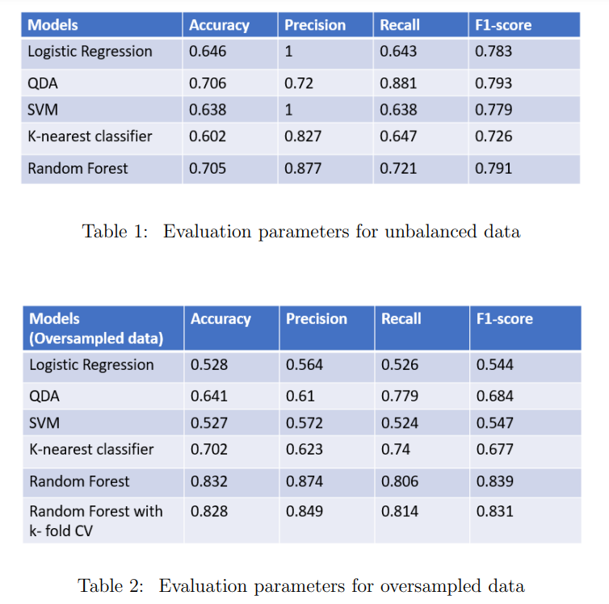

# Water-Potability-Prediction-

## Purpose:
This work has been done by a team of four [Palak Jain](https://www.linkedin.com/in/palakjn/), [Vijay Mittal](https://www.linkedin.com/in/vjmittal/), Akshya Ramesh, and Raj Zaveri as a final project for Data Analytics- H515 course in Spring 2022 at Indiana University.

## Project Description :
From the past few years, water quality has been degrading and threatened because of various pollutants, industrial waste, release of non-compostable materials and chemicals in the water bodies and many other human intervention and this in turn has led to lack of availability of clean water becoming a more and more serious problem.
Therefore, there is a necessity to check water quality standards before use. In this project, we have determined water potability based on various other features such as ph, hardness,amount of solids, sulfate, chloramines and few others. We have tried to solve this water potability problem using Machine Learning classification models. We have basically tried to determine if the water is potable or not based on various other factors such as water pH value, sulphate level in water etc.

## About the Dataset :
The dataset is obtained from kaggle community website:  
[Kaggle](https://www.kaggle.com/datasets/adityakadiwal/water-potability)

## Exploratory Data Analysis :
The major concern here was that the dataset was imbalanced. Around 61% of the records represents non-potability of water and only 39% records represent potability of water.  
We compared different models for this imbalance data and also oversampled the records of minority class to balance it.

## Approach :
We used different machine learning classification models starting from Logistic regression, SVM, QDA, K-nearest classifier to ensemble methods. As our data was imbalanced, we implemented all the above mentioned models with the original data and also with the over sampled balanced data to check the effect of oversampling on model accuracy.
NOTE : Ensemble methods works well even if the data is imbalance.

## Comparison of different models
Here is the comparison of different models for classfication.

We can see that the random forest algorithm worked best to determine potability of water even if the data is unbalanced. In case of random forest, precision and recall, both were balanced and high for unbalanced data [table 1] as well as over sampled data [table 2]. On the top of that, it is a good practice to use cross validation techniques to deal with unbalanced data. So, we implemented k-fold cross validation for the random forest to verify our oversampling method. Precision and recall, both are nearly same for random forest with cross validation and without cross validation. So, we can conclude that our oversampling method has created a proper balance in the data and therefore, we have ’Random Forest with over sampled data’ as our final model with accuracy of 0.832, precision 0.874, recall 0.806 and f1 score of 0.839.  

[PPT Presentation](static/Data_Analytics_Project_Presentation.ppsx)

